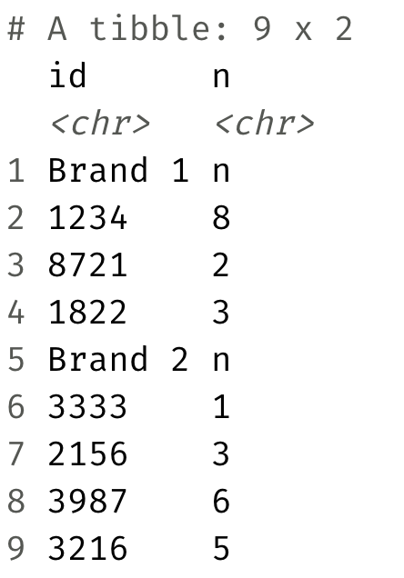
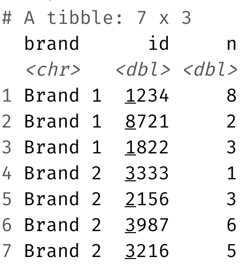

```{r setup, include=FALSE}
knitr::opts_chunk$set(warning = FALSE, message = FALSE)
```

# Introduction

This application exercise has two parts, both about the same real-world skill: getting messy, real data files into R correctly before you can do anything else with them.

**In this application exercise, you will:**

- Read CSV files with `read_csv()` and write data back out with `write_csv()`
- Filter data into subsets and understand file paths and data organization
- Read Excel files with `read_excel()`, handling skipped rows and sheets
- Reshape wide data into tidy long format with `pivot_longer()`
- Practice reproducible, well-organized data workflows

**Estimated time:** 45-60 minutes

---

# Getting Started

## Fork and Clone Workflow

**Quick reminder:** Work in YOUR forked `application-exercises` repository.

1. Navigate to the `ae-06-import-export` folder in YOUR fork
2. Open `ae-06-import-export.Rmd`
3. Update the YAML with your name
4. Verify the `data-raw` folder exists with both `nobel.csv` and `sales.xlsx`

**Detailed instructions in AE 01 if needed.**

---

# Packages
```{r load-packages, warning=FALSE, message=FALSE}
library(tidyverse)
library(readxl)
```

**What these packages do:**

- **tidyverse:** Data wrangling (dplyr), visualization (ggplot2), and reading/writing CSVs (readr)
- **readxl:** Reading Excel files (`.xlsx` and `.xls`)

---

# Part 1: Nobel Winners — CSV Import & Export

In this part, you'll practice reading data from a CSV file and writing data back out to new files — a common workflow when you need to split a dataset into subsets for further analysis.

## Understanding File Paths

Before we start, let's look at the folder structure:

```
ae-06-import-export/
├── ae-06-import-export.Rmd   # This file
├── data-raw/                  # Folder with raw data
│   ├── nobel.csv
│   └── sales.xlsx
└── data/                      # Folder for processed data (you'll create files here)
```

**File paths:**

- To read from `data-raw`: `"data-raw/nobel.csv"`
- To write to `data`: `"data/filename.csv"`

## Exercise 1: Read the Data

Let's first load the data from the `nobel.csv` file in the `data-raw` folder.

**Fill in the blanks:**
```{r read-nobel, eval = FALSE}
nobel <- read_csv("___")
```

**Hint:** The file path is `"data-raw/nobel.csv"`

**What `read_csv()` does:**

- Reads comma-separated values (CSV) files
- Automatically detects column types
- Returns a tibble (tidyverse data frame)

**Verify it worked:**
```{r check-nobel, eval = FALSE}
# Look at the structure
glimpse(nobel)

# See the first few rows
head(nobel)
```

**Task 1.1:** How many Nobel laureates are in the dataset?

**Your answer:** _____ laureates

**Task 1.2:** What variables are in the dataset?

**Your answer:**

___________________________________________________________________________

---

## Exercise 2: Split the Data

Nobel prizes are awarded in different categories. Let's split the data into two groups:

- **STEM laureates:** Physics, Chemistry, Medicine
- **Non-STEM laureates:** Literature, Peace, Economics

**First, explore the categories:**
```{r explore-categories, eval = FALSE}
# See what categories exist
nobel %>%
  count(category)
```

**STEM categories:** Physics, Chemistry, Medicine (Physiology or Medicine)

**Non-STEM categories:** Literature, Peace, Economic Sciences

**Task 2.1:** Fill in the blanks to create a dataset of STEM laureates.
```{r stem-laureates, eval = FALSE}
nobel_stem <- nobel %>%
  filter(category %in% c("___", "___", "___"))
```

**Hints:**

- Use exact category names from the count above
- Medicine might be called "Physiology or Medicine"
- Use `%in%` to check if category is in a vector of values

**How many STEM laureates are there?**
```{r count-stem, eval = FALSE}
nrow(nobel_stem)
```

**Your answer:** _____ STEM laureates

**Task 2.2:** Fill in the blanks to create a dataset of non-STEM laureates.

**Option 1: List the non-STEM categories explicitly**
```{r non-stem-option1, eval = FALSE}
nobel_non_stem <- nobel %>%
  filter(category %in% c("___", "___", "___"))
```

**Option 2: Use NOT IN to exclude STEM categories**
```{r non-stem-option2, eval = FALSE}
nobel_non_stem <- nobel %>%
  filter(!(category %in% c("Physics", "Chemistry", "Physiology or Medicine")))
```

**Explanation of `!(x %in% y)`:**

- `%in%`: Checks if values are in a vector
- `!`: Negation (NOT)
- Together: "NOT in the list"

**How many non-STEM laureates are there?**
```{r count-non-stem, eval = FALSE}
nrow(nobel_non_stem)
```

**Your answer:** _____ non-STEM laureates

**Verification check:**
```{r verify-split, eval = FALSE}
# STEM + non-STEM should equal total
nrow(nobel_stem) + nrow(nobel_non_stem) == nrow(nobel)
```

**Does this equal TRUE?** _____

---

## Exercise 3: Write Out the Data

Now let's save these two subsets as separate CSV files in the `data` folder.

**Create the data folder first (if it doesn't exist):**
```{r create-data-folder}
dir.create("data", showWarnings = FALSE)
```

**Task 3.1:** Write the STEM laureates data to a CSV file.
```{r write-stem, eval = FALSE}
write_csv(___, "data/___.csv")
```

**Hints:**

- First argument: the data frame to write (`nobel_stem`)
- Second argument: the file path (`"data/nobel-stem.csv"`)

**Task 3.2:** Write the non-STEM laureates data to a CSV file.
```{r write-non-stem, eval = FALSE}
write_csv(___, "data/___.csv")
```

**Hint:** Use a different filename like `"data/nobel-non-stem.csv"`

**Verify the files were created:**
```{r verify-files, eval = FALSE}
list.files("data")
```

**You should see:**

- `nobel-stem.csv`
- `nobel-non-stem.csv`

---

## Exercise 4: Read the Data Back In

To verify everything worked, let's read one of the files we just created.
```{r read-back, eval = FALSE}
stem_check <- read_csv("data/nobel-stem.csv")
nrow(stem_check)
```

**Does the number of rows match what you expected?** _____

---

## Exercise 5: Explore the Subsets

**Task 5.1:** Which STEM category has the most laureates?
```{r stem-by-category, eval = FALSE}
nobel_stem %>%
  count(___, sort = TRUE)
```

**Your answer:** _____ has the most STEM laureates.

**Task 5.2:** Which decade had the most non-STEM laureates?

**Hint:** You'll need to create a decade variable first.
```{r non-stem-by-decade, eval = FALSE}
nobel_non_stem %>%
  mutate(decade = (year %/% 10) * 10) %>%
  count(___, sort = TRUE)
```

**Your answer:** The _____s had the most non-STEM laureates.

---

## Exercise 6: Challenge (Optional)

**Task 6.1:** Create a summary that shows the number of laureates by category and gender.
```{r category-gender-summary, eval = FALSE}
nobel %>%
  count(___, ___) %>%
  pivot_wider(names_from = ___, values_from = ___)
```

**Task 6.2:** Write this summary to a CSV file called `nobel-summary.csv`.
```{r write-summary, eval = FALSE}
# Your code here
```

---

# Part 2: Sales — Reading Excel Files

Excel files are often formatted for humans to read, not for computers to analyze. Common issues include merged cells, multiple header rows, empty rows at the top, data spread across multiple sheets, and inconsistent column names.

**Your goal:** Read the sales data and reshape it into a tidy format.

## Exercise 7: Read the Excel File

First, let's look at what the raw Excel file looks like. Here's a screenshot of the target format:
```{r sales-screenshot-1, echo=FALSE, out.width="40%", fig.align='center', fig.alt="Screenshot of the raw sales.xlsx file, showing brands as rows and years spread across separate columns."}

```

**The data shows sales by brand (rows) and year (columns).**

**Task 7.1:** Read in the Excel file from the `data-raw/` folder.

**First, explore the file:**
```{r explore-excel}
# See what sheets are in the file
excel_sheets("data-raw/sales.xlsx")

# Read with default settings to see what happens
read_excel("data-raw/sales.xlsx")
```

**Problems you might notice:**

- Empty rows at the top
- Column names might not be in the first row
- Multiple sheets (maybe?)

**Task 7.2:** Read the file correctly by skipping rows if needed.
```{r read-sales, eval = FALSE}
sales <- read_excel(
  "___",           # File path
  skip = ___       # Number of rows to skip (try 0, 1, 2, 3 and see what works)
)

sales
```

**Hints:**

- `skip = 3`: Skips the first 3 rows
- Try different skip values to see which gives clean column names
- The first column should be brand names

**How many rows and columns does the sales data have?**

**Your answer:** _____ rows and _____ columns

---

## Exercise 8: Understanding the Data Structure
```{r examine-sales, eval = FALSE}
glimpse(sales)
sales
```

**Task 8.1:** What does each row represent?

**Your answer:**

___________________________________________________________________________

**Task 8.2:** What does each column represent?

**Your answer:**

___________________________________________________________________________

**Task 8.3:** Is this data in tidy format? Why or why not?

**Reminder — Tidy data rules:**

1. Each variable is a column
2. Each observation is a row
3. Each value is a cell

**Your answer:**

___________________________________________________________________________
___________________________________________________________________________

**Hint:** In tidy format, "year" should be a single column, not multiple columns.

---

## Exercise 9: Reshape to Tidy Format (Stretch Goal)

The goal is to reshape the data to look like this:
```{r sales-screenshot-2, echo=FALSE, out.width="30%", fig.align='center', fig.alt="Screenshot of the target tidy sales format, with separate brand, year, and sales columns."}

```

**This means:**

- One column for `brand`
- One column for `year`
- One column for `sales` (the values)

**Task 9.1:** Use `pivot_longer()` to reshape the data.
```{r reshape-sales, eval = FALSE}
sales_tidy <- sales %>%
  pivot_longer(
    cols = ___,                    # Which columns to pivot (all except brand)
    names_to = "___",              # Name for the new column with old column names
    values_to = "___"              # Name for the new column with values
  )

sales_tidy
```

**Hints:**

- `cols = -brand`: All columns except brand
- `names_to = "year"`: Creates a column called "year"
- `values_to = "sales"`: Creates a column called "sales"

**What `pivot_longer()` does:**

- Takes wide data and makes it long
- Column names become values in a new column
- Values from those columns go into another new column

**How many rows does the tidy data have?**
```{r count-tidy-rows, eval = FALSE}
nrow(sales_tidy)
```

**Your answer:** _____ rows

**Why does this number make sense?**

**Your answer:** Original: _____ brands × _____ years = _____ rows in tidy format

---

## Exercise 10: Additional Data Cleaning (Stretch Goal)

**Task 10.1:** Convert the `year` column to numeric.

**Why?** After pivoting, year is stored as character (text), but it should be numeric.
```{r convert-year, eval = FALSE}
sales_tidy <- sales_tidy %>%
  mutate(year = as.numeric(___))

class(sales_tidy$year)
```

**Task 10.2:** Remove any rows with missing sales values.
```{r remove-na, eval = FALSE}
sales_tidy <- sales_tidy %>%
  filter(!is.na(___))

nrow(sales_tidy)
```

**Task 10.3:** Arrange the data by brand and year.
```{r arrange-sales, eval = FALSE}
sales_tidy <- sales_tidy %>%
  arrange(___, ___)

sales_tidy
```

---

## Exercise 11: Visualize the Data

Now that the data is tidy, we can easily create visualizations!
```{r visualize-sales, eval=FALSE, fig.alt="Line chart of sales over time, with one colored line per brand."}
ggplot(sales_tidy, aes(x = year, y = sales, color = brand)) +
  geom_line(linewidth = 1) +
  geom_point(size = 2) +
  labs(
    title = "Sales by Brand Over Time",
    x = "Year",
    y = "Sales",
    color = "Brand"
  ) +
  theme_minimal()
```

**Task 11.1:** Which brand has the highest sales in the most recent year?

**Your answer:** _____

**Task 11.2:** Which brand shows the most growth over time?

**Your answer:**

___________________________________________________________________________

---

## Exercise 12: Write Out the Tidy Data

Save the tidy data to a CSV file for future use.
```{r write-tidy-sales, eval = FALSE}
dir.create("data", showWarnings = FALSE)

write_csv(___, "data/___.csv")
```

**Hint:** Use a filename like `"data/sales-tidy.csv"`

---

## Exercise 13: Challenge (Optional)

**Task 13.1:** Read the sales data from a different sheet (if the Excel file has multiple sheets).
```{r read-sheet2, eval = FALSE}
excel_sheets("data-raw/sales.xlsx")

# sales_sheet2 <- read_excel("data-raw/sales.xlsx", sheet = ___)
```

**Task 13.2:** Calculate the total sales for each brand across all years.
```{r total-sales, eval = FALSE}
sales_tidy %>%
  group_by(___) %>%
  summarise(total_sales = sum(___)) %>%
  arrange(desc(___))
```

---

# Reflection

**What did you learn about file organization and data workflows from the Nobel exercise?**

___________________________________________________________________________
___________________________________________________________________________

**Why is it useful to split data into subsets?**

___________________________________________________________________________

**What was the most challenging part of reading and cleaning the Excel data?**

___________________________________________________________________________
___________________________________________________________________________

**Why is tidy data important for analysis and visualization?**

___________________________________________________________________________
___________________________________________________________________________

**What's one thing you learned about `pivot_longer()`?**

___________________________________________________________________________

---

# Submitting Your Work

**Before you finish:**

1. ✅ Make sure all code chunks run without errors
2. ✅ Fill in all blanks and answer all questions
3. ✅ Check that CSV files were created in the `data` folder
4. ✅ Knit to HTML first to verify everything works

## Git Workflow

1. Click the **Git** pane
2. Check boxes next to all changed files, including:
   - `ae-06-import-export.Rmd`
   - `data/nobel-stem.csv`
   - `data/nobel-non-stem.csv`
   - `data/sales-tidy.csv` (if you completed the stretch goals)
3. Click **Commit**
4. Write a commit message: "Completed AE 06 - Nobels + Sales + Data Import"
5. Click **Commit**
6. Click **Push**
7. Verify your work is on GitHub in **YOUR fork**

**Important:** Commit BOTH your code AND the CSV files you created!

## Generate PDF for Canvas Submission

Once everything works in HTML:

1. Click the **Knit** dropdown arrow
2. Select **Knit to PDF**
3. Wait for PDF generation
4. Find `ae-06-import-export.pdf` in the Files pane
5. Export and save to your computer
6. Submit the PDF to Canvas

**Remember:** Push your `.Rmd` to GitHub (your checkpoint/backup) AND submit the PDF to Canvas. **The PDF is the basis for grading** — make sure it's complete and readable before you submit.

---

# Troubleshooting

**CSV reading/writing issues:**

- **Error: "cannot open file":** Check your file path — make sure `data-raw/nobel.csv` exists
- **Error when writing:** The `data` folder might not exist — run the `dir.create()` code
- **File paths on Windows:** Use forward slashes `/` not backslashes `\`
- **Can't find created files:** Look in the `data` folder in the Files pane
- **`%in%` not working:** Make sure values match exactly (check spelling and capitalization) — use `count(category)` to see exact category names

**Excel reading issues:**

- **Error: "file does not exist":** Check the file path `data-raw/sales.xlsx`
- **Column names are weird:** Try different `skip` values
- **Extra empty columns:** Normal for Excel files — they'll be removed during cleaning
- **Can't install readxl:** Make sure you've loaded the package: `library(readxl)`

**Pivot issues:**

- **Too many/too few rows after pivot:** Check your `cols` argument
- **Column names not what you expected:** Check `names_to` and `values_to`
- **Year is character not numeric:** Use `mutate(year = as.numeric(year))`

**Visualization issues:**

- **Plot doesn't show:** Make sure data is tidy first
- **Too many lines:** Check that you completed the pivot correctly
- **Can't see all brands:** Try adjusting colors or using `facet_wrap(~brand)`

**If you're stuck:**

- Review the walkthrough video
- Check documentation: `?read_csv`, `?read_excel`, `?excel_sheets`, `?pivot_longer`
- Ask on the discussion board
- Attend office hours

---

# Quick Reference

| Function | Package | Use |
|:---------|:--------|:----|
| `read_csv()` | readr | Read a comma-separated values file into a tibble |
| `write_csv()` | readr | Write a data frame out to a CSV file |
| `read_excel()` | readxl | Read an Excel file, with options for sheet, skip, and column names |
| `excel_sheets()` | readxl | List all sheet names in an Excel file |
| `pivot_longer()` | tidyr | Reshape wide data into long/tidy format |
| `dir.create()` | base R | Create a new folder (won't error if it already exists) |
| `list.files()` | base R | List files in a folder |
| `file.exists()` | base R | Check if a file exists |
